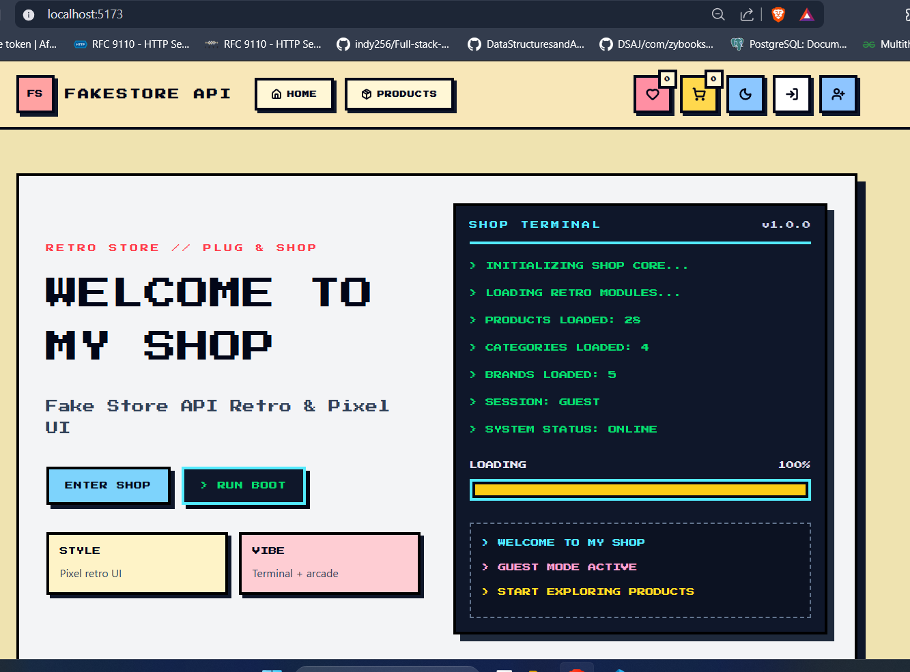
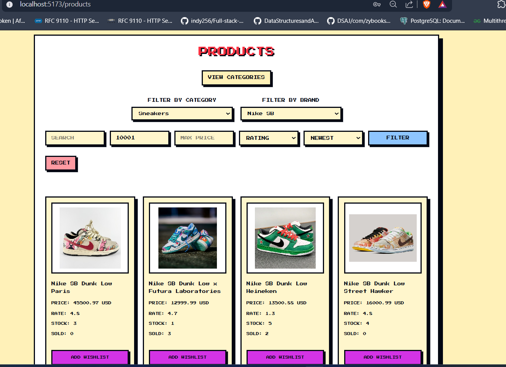

# FakeStoreApi_26

#### Description
**The APP named FakeStoreApi is an e-commerce REST API application designed to support both mock data and real data for use in shopping websites.**

## Bachelor's Thesis
**A Scientific and Technological Approach to E-Commerce Implementation Using Microservices and Augmentative Artificial Intelligence**

